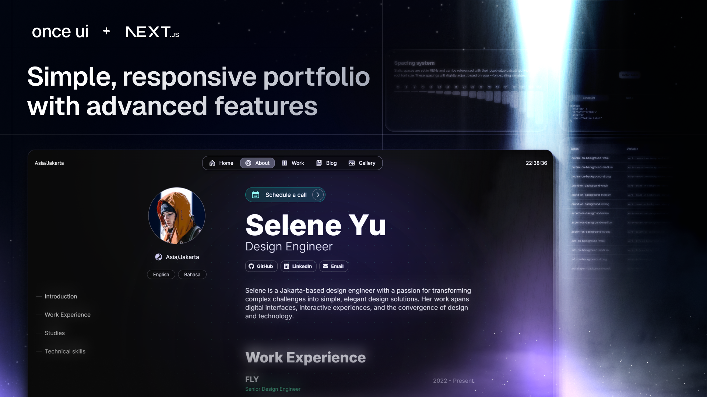

# **Eric's Magic Portfolio**

Welcome to my personal portfolio website, built with [Once UI](https://once-ui.com) and [Next.js](https://nextjs.org).



# **About This Site**

This is my personal portfolio website where I showcase my work and share my thoughts. It's built using the powerful Once UI system, providing a clean, modern, and responsive design that focuses on content presentation.

# **Getting Started**

This portfolio requires Node.js v18.17+.

**1. Install dependencies**
```
npm install
```

**2. Run dev server**
```
npm run dev
```

**3. Configuration**
```
src/app/resources/config
```

**4. Content Management**
```
src/app/resources/content
```

**5. Adding Content**
- Blog posts: Add `.mdx` files to `src/app/[locale]/blog/posts`
- Projects: Add `.mdx` files to `src/app/[locale]/work/projects`

**6. Image Optimization**
```
node scripts/optimize-images.js
```

# **Features**

## **Technology Stack**
- Built with [Once UI](https://once-ui.com) and Next.js
- Modern, responsive design
- SEO optimized
- Customizable theming

## **Content Features**
- Blog section for sharing thoughts and experiences
- Project showcase
- Gallery support
- About/CV section
- Social media integration
- Optional password protection for specific content

## **Multilingual Support**
- Built-in localization support using next-intl
- Configurable in resources/config.js

# **Author**

**Eric Swanson**
- [GitHub](https://github.com/ericswanson)
- [LinkedIn](https://www.linkedin.com/in/ericswanson/)

*Built with [Once UI](https://once-ui.com)*

# **License**

Distributed under the CC BY-NC 4.0 License.
- Commercial usage is not allowed
- Attribution is required

See `LICENSE.txt` for more information.

# **Deploy**
[](https://vercel.com/new/clone?repository-url=https%3A%2F%2Fgithub.com%2Fonce-ui-system%2Fmagic-portfolio&project-name=portfolio&repository-name=portfolio)